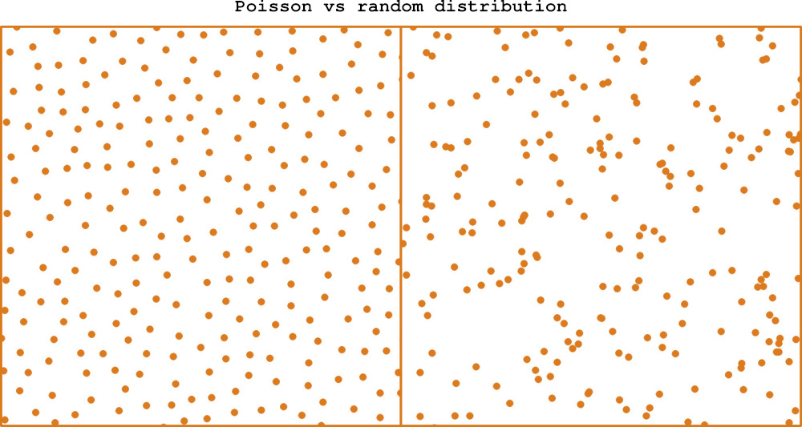

# Poisson Disc Sampling (in 2 dimensions)

## About

Poisson disc distribution produces evenly randomly distributed points, where
all points are at least _minimum distance_ apart.

## Usage

`PoissonDiscSampling.generate(min_dist, area_width, area_height, samples)`

**min_dist** - minimum distance between points

**samples** - maximum number of attempts to find a new suitable point in
    each step (typically 30)

The algorithm divides the area into a grid and places at most one point into
each cell.

Returns list of `{x, y}` points.

## Sample app

[Poisson & Colors](https://art-code.herokuapp.com/poisson-colors)

## Further Reading

- This implementation uses an algorithm by Robert Bridson:
[Fast Poisson Disk Sampling in Arbitrary Dimensions](http://www.cs.ubc.ca/~rbridson/docs/bridson-siggraph07-poissondisk.pdf)

- [https://www.jasondavies.com/poisson-disc/](https://www.jasondavies.com/poisson-disc/)
